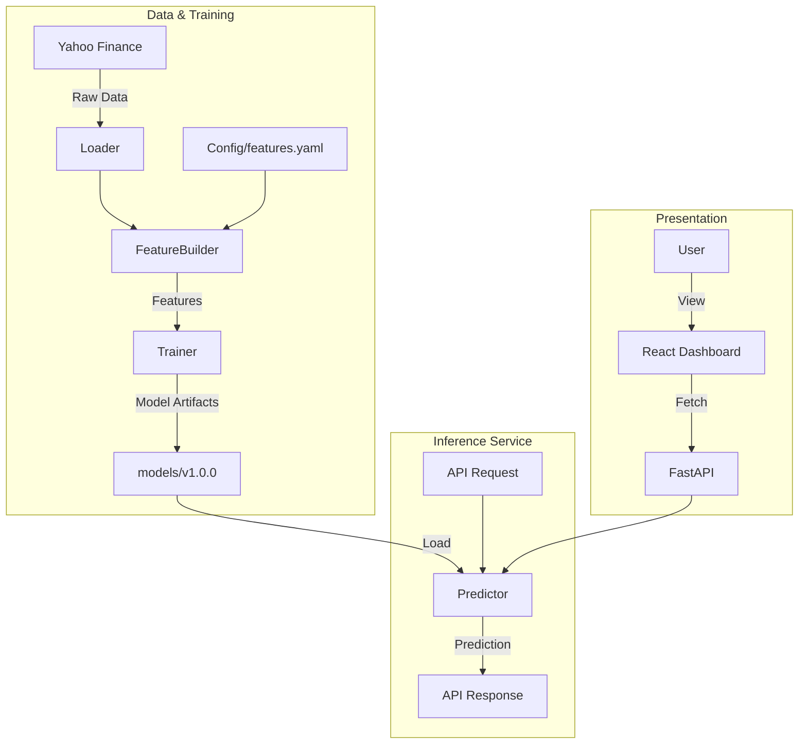

# 📈 Stock Price Prediction System (Enterprise Edition)

A production-grade, full-stack machine learning application designed for reliable stock price forecasting. This project demonstrates a canonical architecture for ML systems, enforcing strict contracts between training and inference pipelines to prevent model drift.

## ✨ Key Features

*   **Strict Feature Contracts**: `features.yaml` serves as the single source of truth, ensuring training and inference pipelines use identical feature engineering logic.
*   **Stateless Inference Engine**: The `Predictor` class validates loaded model artifacts against the codebase version to ensure compatibility.
*   **Attention-Based LSTM**: Utilizes a custom Bi-Directional LSTM with Attention mechanism for capturing long-term dependencies in time-series data.
*   **Modern Frontend**: A responsive, "dark-mode" dashboard build with React 18, Vite, and Tailwind CSS.
*   **Robust Backend**: FastAPI service with Pydantic validation, health checks, and secure CORS configuration.
*   **Enterprise Ready**: Dockerized architecture with multi-stage builds and versioned model artifact management.

## 🏗 System Architecture



## 🛠 Technology Stack

*   **ML Core**: TensorFlow/Keras, Scikit-learn, Pandas, Numpy.
*   **Backend**: FastAPI, Uvicorn, Pydantic.
*   **Frontend**: React, TypeScript, Vite, Tailwind CSS, Lucide Icons.
*   **DevOps**: Docker, Docker Compose, Pytest.

## 🚀 Getting Started

### Prerequisites

*   Python 3.10+
*   Node.js 18+

### 1. Installation

**Backend Setup:**
```bash
# Clone the repository
git clone <repo-url>
cd Stock-Price-Prediction

# Install Python dependencies
pip install -r requirements.txt
```

**Frontend Setup:**
```bash
cd frontend
npm install
cd ..
```

### 2. Model Training
Train a new model version. This process downloads data, validates the feature contract, trains the LSTM model, and saves versioned artifacts.

```bash
python -m src.training.trainer
```
*Artifacts will be saved to `models/vYYYYMMDD_HHMMSS/`.*

### 3. Running the Application

**Start the Backend API:**
```bash
uvicorn src.api.main:app --host 0.0.0.0 --port 8000
```
*API will be available at http://localhost:8000*

**Start the Frontend Dashboard:**
```bash
cd frontend
npm run dev
```
*Dashboard will be available at http://localhost:5173*

## 📚 API Documentation

| Method | Endpoint | Description |
| :--- | :--- | :--- |
| `GET` | `/health` | System health and model status. |
| `GET` | `/metadata` | Current feature contract and configuration. |
| `GET` | `/models` | List all available model versions. |
| `POST` | `/predict` | Generate stock price prediction. |

**Example Prediction Request:**
```json
{
  "symbol": "TSLA",
  "model_version": "v20251223_223009"
}
```

## 🧪 Testing

Run the comprehensive test suite to verify system integrity.
```bash
pytest
```

## 🐳 Docker Deployment

Build and run the entire stack using Docker.

```bash
docker build -t stock-predictor .
docker run -p 8000:8000 stock-predictor
```

## 🤝 Contributing
1.  Fork the repository.
2.  Create a feature branch (`git checkout -b feature/amazing-feature`).
3.  Commit your changes.
4.  Push to the branch.
5.  Open a Pull Request.

---
*Built for the Advanced Agentic Coding Challenge.*
